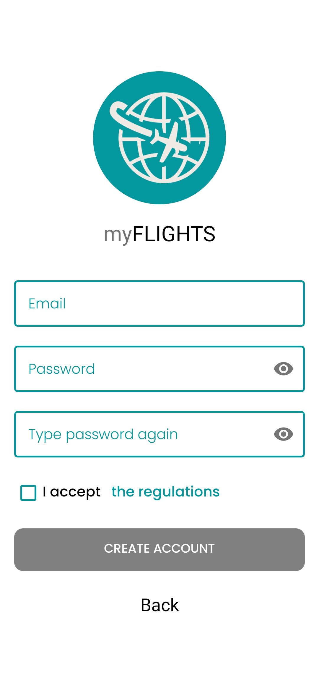

# MyFlights

Simple application that allows user to store his flights. User is able to define airports and airplanes, and then create 
flights from one airport to another one using selected airplane. Application written in Kotlin uses api provided
by server from [MyFlightsServer reposirory](https://github.com/DominikKossinski/MyFlightsServer).

The application is connected to Analytics and Crashlytics.

## Demo

###

<h3 align="center">Pre login | Login | Create Account</h3>

  
   
  

<h3 align="center">Flights | Airplanes | Airports | Statistics</h3>

  
   
   
  

### Features

- MVVM architecture.
- Swipe Delete in fragments displaying lists of airplanes, airports and flights.
- Firebase authentication.
- FCM with DeepLinks

## Used dependencies

- [Kotlin Coroutines](https://developer.android.com/kotlin/coroutines)
- [Kotlin Flow](https://developer.android.com/kotlin/flow)
- [AndroidX](https://developer.android.com/jetpack/androidx)
- [Navigation Component](https://developer.android.com/training/dependency-injection/hilt-android)
- [Hilt](https://developer.android.com/training/dependency-injection/hilt-android)
- [Retrofit](https://square.github.io/retrofit/)
- [Gson](https://github.com/google/gson)
- [Glide](https://github.com/bumptech/glide)
- [Espresso](https://developer.android.com/training/testing/espresso)
- [RuntimePermission](https://github.com/florent37/RuntimePermission)
- [Firebase](https://firebase.google.com/docs/android/setup)
- [Analytics](https://firebase.google.com/docs/analytics)
- [Crashlytics](https://firebase.google.com/docs/crashlytics/)
- [Firebase Cloud Messaging](https://firebase.google.com/docs/cloud-messaging/)
- [Firebase Dynamic Links](https://firebase.google.com/docs/dynamic-links)
- [ML-Kit Scanning Barcodes](https://developers.google.com/ml-kit/vision/barcode-scanning/android)
- [QRGen](https://github.com/kenglxn/QRGen)

## Other Sources

- Scanning QR codes with ML-Kit - [Android Scanning Barcode By Arun Chandravanshi](https://github.com/arunk7839/BarcodeScannerExp)
